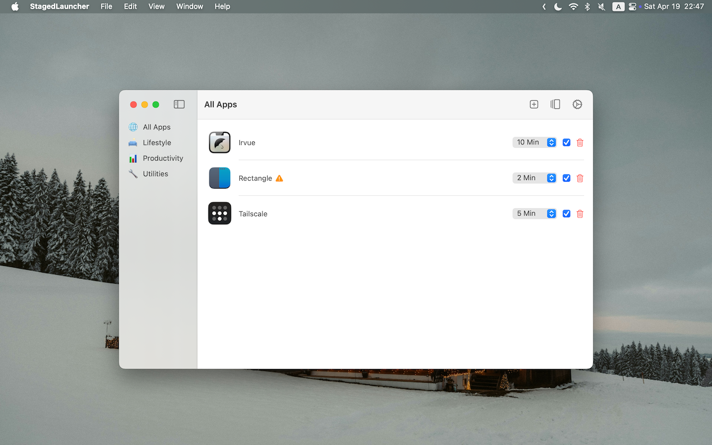

```bash

   _____ _                       _   _                            _
  / ____| |                     | | | |                          | |
 | (___ | |_ __ _  __ _  ___  __| | | |     __ _ _   _ _ __   ___| |__   ___ _ __
  \___ \| __/ _` |/ _` |/ _ \/ _` | | |    / _` | | | | '_ \ / __| '_ \ / _ \ '__|
  ____) | || (_| | (_| |  __/ (_| | | |___| (_| | |_| | | | | (__| | | |  __/ |
 |_____/ \__\__,_|\__, |\___|\__,_| |______\__,_|\__,_|_| |_|\___|_| |_|\___|_|
                   __/ |
                  |___/
```

A macOS utility with staged startup support. Manage startup applications and improve system performance by delaying app launches.

## Features

- Native SwiftUI interface
- Staged startup with customizable delays (3, 5, or 10 minutes)
- Enable/disable individual apps
- Add apps from running apps or manually select

Requires macOS 14.0+.

## Install

### Homebrew

```bash
brew tap hewigovens/tap
brew install --cask staged-launcher
```

## Usage

1. Launch Staged Launcher
2. Click "+" to add an app
3. Set a startup delay
4. Enable/disable items with the toggle



## Contributing

See [CONTRIBUTING.md](CONTRIBUTING.md).

## License

BSL 1.1 — free to use, modify, and redistribute; paid app store distribution requires permission. Converts to Apache-2.0 on 2030-03-23. See [LICENSE](License).
